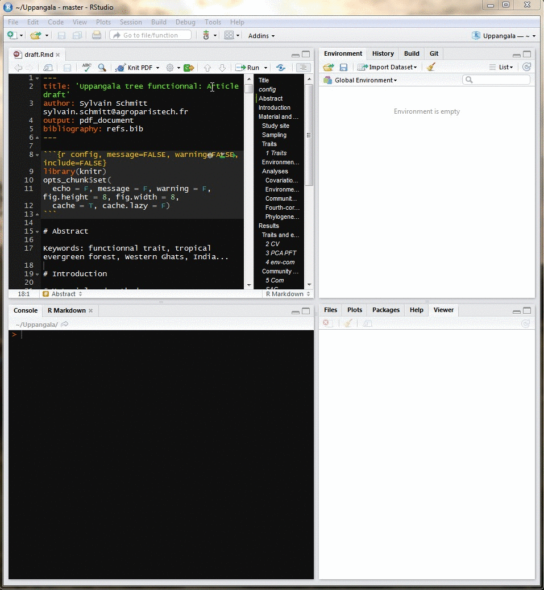

```{r setup, include=FALSE}
knitr::opts_chunk$set(echo = TRUE)
```

[](https://travis-ci.org/sylvainschmitt/Cite)
[](http://cran.rstudio.com/package=Cite)
[](http://www.r-pkg.org/pkg/Cite)

**Cite** is a RStudio-Addin that uses the `rstudioapi` package and provides a GUI to insert bibliography entries in Rmarkdown document with a BibTex file.

For a full list of features see [`NEWS`](./NEWS.md).

## Installation

Please be aware that you need the **most recent (stable) release of RStudio** (v0.99.878 or later). Additionally, **Cite** depends on [`shiny`](https://github.com/rstudio/shiny), [`miniUI`](https://github.com/rstudio/miniUI) and `RefManageR`.

#### Install from Github
You can install the latest version of **Cite** from Github using the [`devtools`](https://github.com/hadley/devtools) package:
```r
if (!requireNamespace("devtools", quietly = TRUE))
  install.packages("devtools")

devtools::install_github("sylvainschmitt/Cite")
```

## Usage

After installing, **Cite** is available in the Addins menu within RStudio.

<center>[**Click to enlarge**](https://raw.githubusercontent.com/sylvainschmitt/Cite/master/examples/cite.gif)<center>

